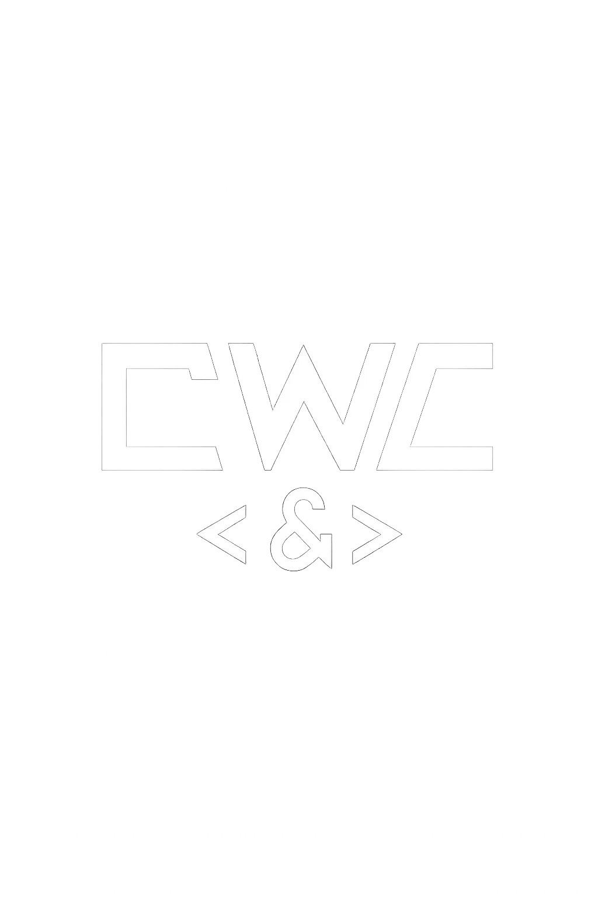
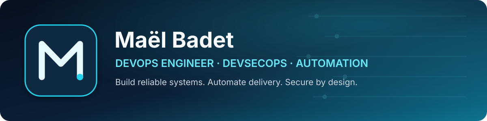

<div align="center">

<a href="https://mael-badet.fr">
  
</a>

<br />



<br />

[](https://mael-badet.fr)
[](mailto:cwc@mael-badet.fr)
[](https://github.com/maelbadet)

</div>

## About me

I'm a **DevOps Engineer and web developer** based in Nantes, France. I design, secure, deploy and improve digital products with a strong focus on reliability, performance and business value.

Through **Code and Web Consulting**, I support companies, SMEs and independent professionals with web development, cybersecurity, SEO, DevOps and automation.

- 🔭 Building CI/CD pipelines, monitoring platforms and self-hosted infrastructure
- 🛡️ Focused on DevSecOps, secrets management and application security
- 🎓 Completing a Master's-level program in secure software development
- ☁️ Expanding my expertise in Kubernetes, AWS and cloud-native architecture
- 🤝 Open to DevOps, cybersecurity, automation and web collaborations

## Technical expertise

<table>
<tr>
<td valign="top" width="50%">

### Infrastructure & DevOps


</td>
<td valign="top" width="50%">

### CI/CD & Security


</td>
</tr>
<tr>
<td valign="top" width="50%">

### Observability


</td>
<td valign="top" width="50%">

### Development


</td>
</tr>
</table>

## Featured projects

| Project | What it demonstrates | Technologies |
|---|---|---|
| [**Docker Project**](https://github.com/maelbadet/docker-project) | Containerized architecture and Docker-based environment | Docker, containers, infrastructure |
| [**Jenkins CI/CD**](https://github.com/maelbadet/jenkins-cicd) | Automated build and delivery pipeline | Jenkins, CI/CD, Docker |
| [**n8n Client Autofinder**](https://github.com/maelbadet/n8n-client-autofinder) | Automated prospect discovery and qualification workflow | n8n, automation, APIs |
| [**n8n Video Automation**](https://github.com/maelbadet/n8n-aumatisation-video) | AI-assisted content production workflow | n8n, AI, content automation |

## Engineering principles

```text
Automate repetitive work  •  Observe everything  •  Secure by design
Ship in small increments   •  Document decisions  •  Keep systems recoverable
```

## Contact

Have a DevOps, cybersecurity, automation or web project?

- **Website:** [mael-badet.fr](https://mael-badet.fr)
- **Professional email:** [cwc@mael-badet.fr](mailto:cwc@mael-badet.fr)

<div align="center">
  <sub>Code and Web Consulting — Concevoir. Sécuriser. Déployer. Faire grandir.</sub>
</div>
